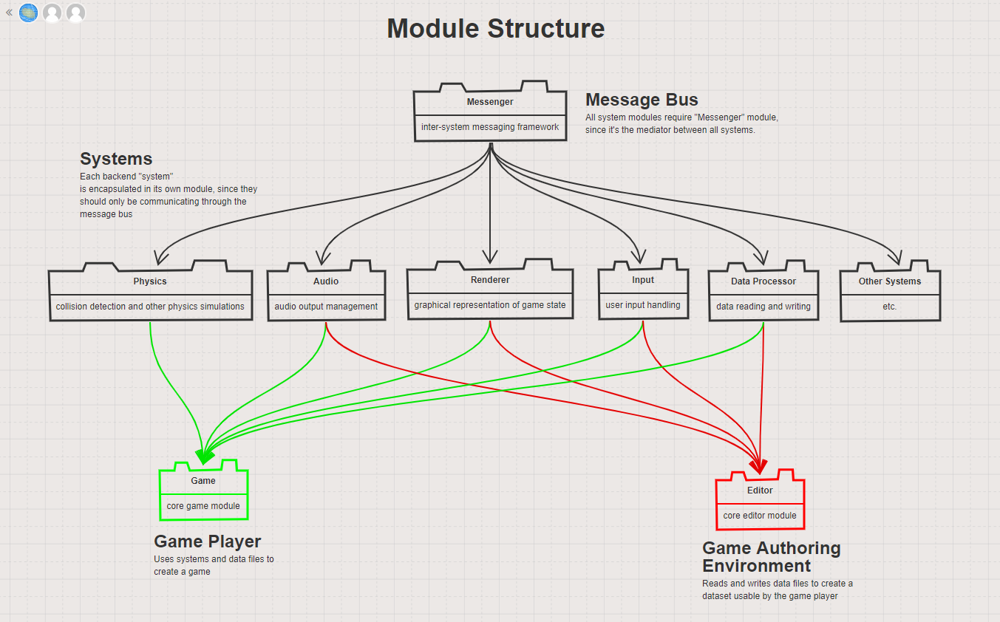

VOOGASalad Design
===

## Introduction
*This section describes the problem your team is trying to solve by writing this program, the primary design goals of the project (i.e., where is it most flexible), and the primary architecture of the design (i.e., what is closed and what is open). Describe your chosen game genre and what qualities make it unique that your design will need to support. Discuss the design at a high-level (i.e., without referencing specific classes, data structures, or code).*

We are creating this program to allow people with little to no programming background the ability to create a wide array of dynamic 2D fighting games. This includes the ability to control character creation, the ability to define combat physics, and the ability to design new stages to fight on.

The primary design goals for this project are to encapsulate project components as much as possible in order to allow great flexibility in creating new components and supporting new features, and to allow designers the ability to create any fighting game imaginable.

We chose the fighting game genre. In this genre, typically, two or more players who control their own characters will battle each other on a certain stage until a win condition has been met. There are several elements that make this game style unique. One of these is the “attack” mechanic of each character. Players will typically have heavily differentiated attack characteristics. Each character has its own hitbox, animation, and moveset, and each attach has its own animation, range, damage dealt, etc.

At a high level, our architecture will consist of a uniform module called the "message bus" that is passed between the different elements of our game that contains all of the inputs and outputs that get passed between the frontend and backend. Each of the game subsystems, such as the physics engine, audio system, etc., will be encapsulated in its own module as well. This will allow us to compartmentalize development, and test our program concurrently without the entire program already written. 

## Overview
*This section serves as a map of your design for other programmers to gain a general understanding of how and why the program was divided up, and how the individual parts work together to provide the desired functionality. Describe specific modules you intend to create, their purpose with regards to the program's functionality, and how they collaborate with each other, focusing specifically on each one's API. Include a picture of how the modules are related (these pictures can be hand drawn and scanned in, created with a standard drawing program, or screen shots from a UML design program). Discuss specific classes, methods, and data structures, but not individual lines of code.*

#### Module Structure: 
Our design will be composed of a multi-level module structure. At the lowest level, there will be a Messenger module, which provides the functionality for creating or supporting a MessageBus, which is the system through which all other systems will communicate with each other. Therefore, all other systems, such as Input Handling, Audio, Physics, etc., will all require this Messenger module. These other systems will also be individual modules, since their functionality should be entirely encapsulated and should only interact with the other systems through the Messenger system. Up on the highest level, the Game Player and the Game Editor will require the specific systems that they need in order to establish their functionality. For example, while the Game Player will likely require such systems as a Render system, Audio system, Input system, Physics system, etc., the Game Editor will not require the Physics system, so it does not need to require it. 



#### Class Structure:

* Module: Game Player
* Module: Game Editor
* Module: Console
* Module: Physics System
    * Exported (exposed):
        * ```      ```
    * Not Exported (encapsulated):
        * 
* Module: Audio System
* Module: Render System
    * Exported (exposed):
        * ``` public class Renderer```
            * ``` public Button makeStringButton(String text, Color buttonColor, Color textColor, Double x, Double y)```
            * ```public Button makeImageButton(Image image, Double x, Double y)```
            * ```public Text makeEmphasisText(String text, Integer fontsize, Color color, Double x, Double y)```
            * ```public Text makePlainText(String text, Integer fontsize, Color color, Double x, Double y)```
            * ```public ScrollPane makeGridScrollPane(List<ImageView> contentList)```
            * ```public ScrollPane makeListScrollPane(List<Data> dataList)```
            * ```public void drawStage(Group root, Level level)```
            * ```public TextField makeTextField(String text)```
            * ```public Slider makeSlider(Double field)```
            * ```public FileChooser makeFileChooser(String filetype)```
            * ```public DirectoryChooser makeDirectoryChooser()```
            * ```public SwitchButton makeSwitchButtons(List<String> options)```
            * ```public Carousel makeCarousel(List<String> options)```
            * ```java
              public SpriteAnimation makeSpriteAnimation(Sprite sprite,
              Double duration, Integer count, Integer columns, Double offsetX, 
              Double offsetY, Double width, Double height) 
              ```
            * ```public Sprite makeSprite(Image image)```
        * ``` public class SwitchButton```
        * ``` public class Carousel```
        * ``` private class SpriteAnimation```
        * ```private class Sprite```
    * Not Exported (encapsulated):
* Module: Input System
* Module: Scene System
* Module: Combat System
* Module: Data Processor
* Module: Main

## User Interface

*This section describes how the user will interact with your program (keep it simple to start). Describe the overall appearance of program's user interface components and how users interact with these components (especially those specific to your program, i.e., means of input other than menus or toolbars). Include a wireframe of your GUI(s) as well as describing how a game is represented to the designer and what support is provided to make it easy to create a game. Finally, describe any erroneous situations that are reported to the user (i.e., bad input data, empty data, etc.).*

The user interface will consist of a main window. Upon starting the program, the user will be taken to a start screen, where they can select the option to either create a new fighting game, edit an existing fighting game, or play a fighting game.
[UI Layout](../doc/ui_concept_voogasalad-2.pdf)


## Design Details

*This section describes each module introduced in the Overview in detail (as well as any other sub-modules that may be needed but are not significant to include in a high-level description of the program). Describe how each module handles specific features given in the assignment specification, what resources it might use, how it collaborates with other modules, and how each could be extended to include additional requirements (from the assignment specification or discussed by your team). Look for opportunities to share APIs between your sub-teams (e.g., authoring and player front ends or authoring and engine back ends) that may themselves be separate modules (like Java and JavaFX are composed of several modules). Note, each sub-team should have its own API for others in the overall team or for new team members to write extensions. Finally, justify the decision to create each module with respect to the design's key goals, principles, and abstractions.*

Functionality:

Game player:
* Main menu
    * static background image
    * help text
    * play button
        * neutral
        * on-hover
        * selected
    * asdf
* fight
    * health bar
    * lives left
    * background
    * characters

Game Authoring Environment:
* Camera/View
     * fixed 
     * mobile (horizontal and/or vertical)

* create characters
    * Sprite
        * player controlled (PvP)
        * NPC (PvE)
    * set stats
    * define behaviors for objects using groovy
* create stages
    * Platform 
        * grounded or groundless
        * floating blocks
* HUD 
    
* Composition design pattern
    * user can package what they want in their game into some data object
    * easily interchange pieces
* Sandbox pattern? 

* Save/Load game
    * Save the current state of the game
    * Load a previously-defined game


Main (Game Loop):
* Speed
    * 60 Frames Per Second
    * Interpolation implemented to maintain smoothness
    * Fixed Time Step
* GameLoop()
    * Multi-threaded
    * One thread per loop. Running a second view of the game opens a new Thread
* Update()
    * Calls the physics engine to update game. 
* Render(double Interpolation)
    * Renders the game. Takes into account the interpolation, to keep animations up with speed

Physics:
* RigidBody (Abstract)
    * RigidObject
        * GameElement is composed of this
        * Move according to key input, collisions, and gravity
    * RigidGround
        * Structure is composed of this
        * Never move
        * RigidObjects are stopped by this
        * 2 Basic Types:
            * One that is impenetrable from underneath
            * One that a RigidBody can jump into from underneath and land on top
* Gravity
    * Speed of gravity depends on weight
    * Direction of gravity depends on game authoring settings
* Collision Detection
    * Will check each element each frame (this will be O(n^2), but is easiest)
    * Sectors
* Net force calculator
    * Takes in all the forces acting on a physics object, calculates its net force

* Acceleration calculator
    * Takes in the net force acting on an object and generates acceleration vectors

## Example Games

*Describe three example games from your genre in detail that differ significantly. Clearly identify how the functional differences in these games is supported by your design and enabled by your authoring environment. Use these examples to help make concrete the abstractions in your design.*

#### Super Smash Bros. Brawl:
This game is heavily physics-reliant for combat. Rather than using HP, this game uses a damage percentage, where the higher the percentage, the farther the character is knocked back on impact, and where the character "dies" when they are unable to recover from the impact and fall off the screen. Characters are able to move very fluidly, with with running, jumping, and gliding (trajectory can be changed mid air), and some characters can even, to a limited extent, fly (able to jump many times). The stage for the game is composed of platforms, and often walls or other features that may help or hinder the characters. Characters are incredibly diverse, and actually have characteristics which directly impact the physics, such as their size and weight, which affects the character's hitbox as well as their knockback amount. Characters have a variety of special moves that are extremely diverse and can be melee or ranged, and are able to shield, roll, sidestep, and grab other characters. Additionally, characters have an additional "Final Smash" ability (also incredibly diverse) which is enabled upon scoring the last hit on a "Smash Ball" which is a floating orb that appears at a pseudo-regular interval. However, a character can lose the "Final Smash" opportunity if they are sufficiently damaged while they are in possession of the ability, before they use it. 

#### Street Fighter:
This game is relatively simple in terms of mechanics. Players use attacks and blocks to try and reduce the HP of their opponent to 0, or at least do more damage to the opponent than they receive during the time limit. In this game, players cannot leave the screen and always face each other. Players have certain input options, and special moves are accessed by inputting certain combinations of moves. For example, for the character Ryu, if players input the correct sequence, he will shoot out a "Hadoken" projectile that deals a certain amount of damage to the opponent. Combos are meant to be followed through - similar to smash bros, players must be active in inputting the right buttons to continue a combo. 


#### Mortal Kombat:

## Design Considerations

*This section describes any issues which need to be addressed or resolved before attempting to devise a complete design solution. Include any design decisions that each sub-team discussed at length (include pros and cons from all sides of the discussion) as well as any ambiguities, assumptions, or dependencies regarding the program that impact the overall design.*

* Our project depends on Guava, an open-source Java library by Google, for the asynchronous event bus, so remember to add the Maven dependency to the project when pulling from the repository for the first time. 
* Some issues that need to be addressed include what information we plan on sending to and receiving from the message bus and how to format the data files we will use.
